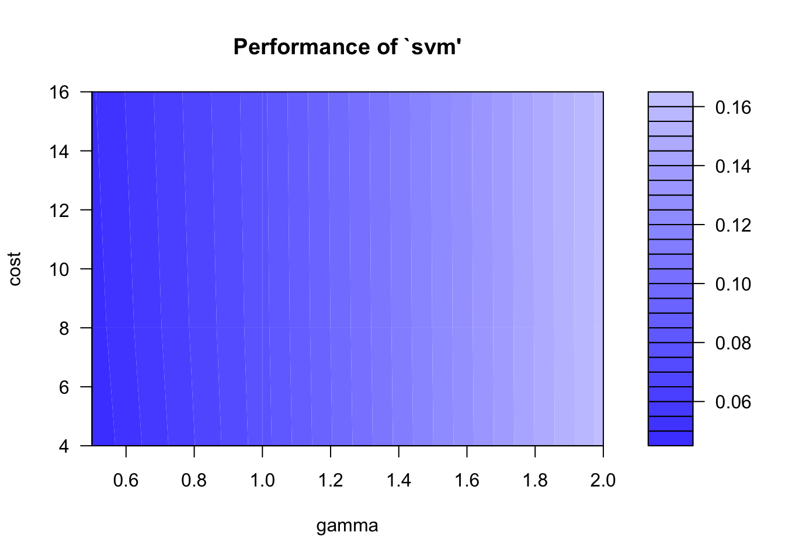
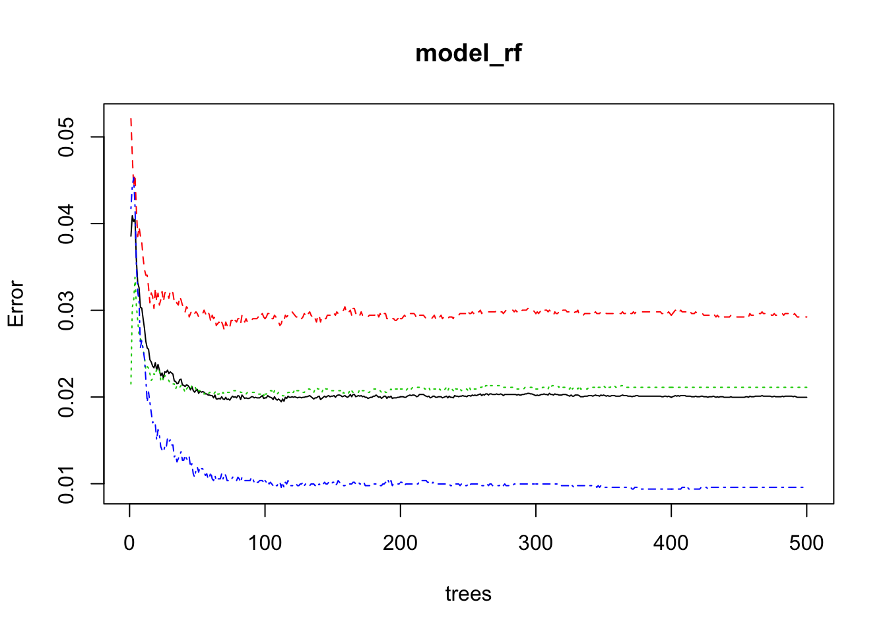
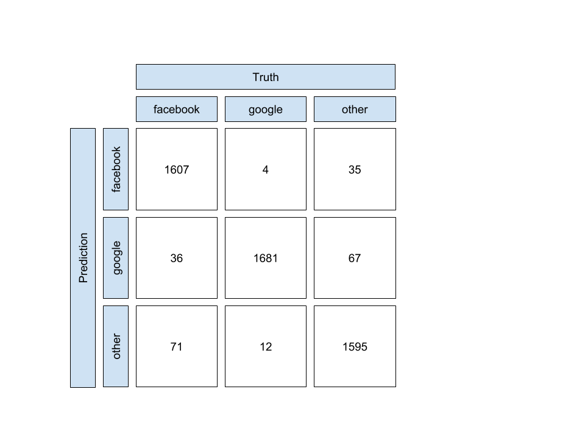

```{r setup, include=FALSE}
library(pander)
library(png)
library(knitr)

Sys.setenv(RSTUDIO_PANDOC = "/Users/jabley/Library/Haskell/bin")
Sys.setenv(PATH = paste(Sys.getenv('PATH'), '/Users/jabley/Library/Haskell/bin', sep=':'))

knitr::opts_chunk$set(echo = FALSE, fig.align="center")
```

# Introduction
\label{sec:introduction}

The Domain Name System (DNS) includes a wire protocol with which structured requests and responses are exchanged over a network. The DNS protocol was originally specified [@rfc1034][@rfc1035] for use over both the Transmission Control Protocol (TCP) [@rfc793] and the User Datagram Protocol (UDP) [@rfc768] and the use of other transports have also been documented [@rfc7858][@rfc8484][@huitema-quic-dnsoquic-05]. At present, however, UDP is the overwhelmingly dominant transport protocol in use; for example, according to statistics published by ICANN for queries received at the L root server, UDP accounts for 98% of all queries received.\footnote{\url{http://stats.dns.icann.org/plotcache/L-Root/transport_vs_qtype/2018-12-03T00:00-2018-12-03T23:59-all.html}}

Since UDP transport for DNS is stateless, consisting of single-datagram queries and responses with no setup or tear-down handshake, there are limited opportunities to verify the legitimacy of a source address. DNS servers are consequently frequently used as amplifiers in reflection attacks [@rfc5358]. Although some such attacks are trivially identified, e.g. by Query Type (QTYPE), many are more difficult. By choosing query parameters that match legitimate, real-world use of the DNS, attackers can make it difficult for their traffic to be identified and blocked without causing collateral damage. This is especially true of amplification attacks against DNS resolvers.

The clients of authoritative DNS servers are most usually DNS resolvers. These client systems receive requests from end-user applications (or downstream resolvers). Different client resolver systems are observed to send different mixes of DNS traffic; for example, a resolver system that mainly serves end-users will send a different mixture of queries to authoritative servers than one which serves a specific application like Internet mail [@rfc5321], which might reasonably be expected to have a much higher proportion of query traffic with \texttt{QTYPE=MX}.

Afilias Canada\footnote{\url{https://afilias.info/}} operates authoritative DNS infrastructure for around 300 top-level domains, including several that attract high levels of query traffic such as INFO and ORG. This infrastructure is distributed globally using anycast service distribution [@rfc4786], using commodity transit services, public peering and so-called Private Network Interconnects (PNIs). The real origin of queries received over a PNI can be known with high accuracy; the origin of queries received over the Internet, in contrast, cannot. We refer to the former as *trusted* paths, and the latter as *untrusted*. Trusted paths exist to Google Public DNS,\footnote{\url{https://dns.google.com}} a public DNS resolver system configured for use by a large number of end-users, and Facebook,\footnote{\url{https://www.facebook.com}} whose resolver systems are mainly used by back-end systems that build previews for links shared between users of Facebook's social media platform. The traffic patterns of each are expected to be usefully different.

While real-time anomoly detection in DNS traffic remains an elusive problem, the ability to classify traffic apparently received by particular sources as being legitimate is useful in the forensic analysis of traffic spikes since it provides the opportunity to distinguish between illegitimate, unwanted traffic and traffic from clients that just happen to be busy, e.g. due to a burst in popularity in a particular web page, or changes in the Time To Live (TTL) parameters of high-use domain names. This paper describes a system that aims to provide such a classification.

We collected a raw DNS dataset in the form of individual (request, response) DNS messages received from and sent to a single apparent source over period of two weeks. We split the resulting query stream into five minute intervals and from each we extract a vector of variables that describes the traffic received from each client during that time. Each such vector, once normalised, represents a single observation related to a single client. Observations that correspond to traffic received from the trusted sources, in this case Google and Facebook, can be used as a training dataset. Observations corresponding to DNS traffic that definitively did not arrive from a trusted source can also be incorporated as "other". The resulting model can be used to classify five-minute samples of query streams from purported single sources to classify the origin of the query traffic as "facebook", "google" or "other". Since query sources for each category feature in an equal number of traffic samples, it is straightforward to produce a training dataset that is balanced across the three categories.

This paper is organised as follows. Section \ref{sec:introduction} introduces the problem and provides some high-level background on the DNS. Section \ref{sec:background} provides a short introduction to the algorithms and accuracy measures that are used to build the model. Some other work on applying machine learning techniques to problems in the DNS are described in section \ref{sec:related}. Data collection and preprocessing, feature engineering and choice of learning and validation algorithms are discussed in section \ref{sec:methodology}. Section \ref{sec:evaluation} describes the evaluation of the resulting model. Section \ref{sec:conclusion} provides a summary of the work described in this paper, and section \ref{sec:future} identifies some areas for future study.

# Background
\label{sec:background}

Two multiclass classifiers are evaluated for this model in section \ref{sec:classifiers}, below. The approach used to evaluate the accuracy of each is described in section \ref{sec:accuracy}. These models are used to classify features of individual five-minute samples of DNS reponse data according to source system by treating each sample as a single observation. A brief discussion of other approaches that might usefully consider each sample as a point along a time series can be found in section \ref{sec:future}.

## Classifier Models
\label{sec:classifiers}

We consider both Support Vector Machine and Random Forest models and select the most successful one based on 10-fold validation.

### Multiclass Support Vector Machine
\label{sec:svmmethod}

The classifier used in this paper was constructed as a series of Support Vector Machines (SVM), each used as a binary classifier. SVM represents $n$-dimensional support vectors in an $n$-axis hyperspace and identifies a hyperplane boundary between observations known to be in different categories to facilitate classification of unlabelled test sets. Those boundaries can then be used to classify unlabelled observations.

Multiclass classification is achieved using $k(k-1)/2$ *one-against-one* binary classifiers combined with a max-wins voting scheme, as discussed in [@10.1007/11494683_28].

The SVM implementation used to construct this model exposes several hyperparameters that can be tuned, as well as a native grid search to assist identification of optimal parameters for a supplied validation dataset.

### Random Forest
\label{sec:rfmethod}

Random Forests (RF) [@Breiman2001] combine many decision trees at training time into an ensemble learning model. RF uses bootstrap samples to introduce a random component into the tree-building process, whilst also reducing correlation amongst trees, adding noise to perturb the tree structure and using a random subset of available predictors each each split. Each of $m$ models in the resulting ensemble is used to generate a prediction for a new sample and those predictions are averaged to give the prediction from the entire forest.

The tuning parameters for the RF ensemble model are:

 * the size of the subset of predictors randomly selected at each split, $m_{try}$. Breiman suggests [@Breiman2001] setting $m_{try}$ to be the square root of the number of predictors.
 * the number of trees in the forest. Breiman has proved that random forests are immune from overfitting, but but there might be some benefit in computational expense in limiting the size of the forest to the number of the trees that provides measurable benefit.

## Accuracy Measures
\label{sec:accuracy}

We calculate a confusion matrix over a test dataset:

```{r out.width='50%'}
knitr::include_graphics('confusion_matrix.png')
```

Since we intend to ensure that we have a balanced dataset between the three classifications of traffic samples, we are able to use a straightforward measure of accuracy, A:

$$A = \frac{TP + TN}{TP + FP + TN + FN}$$

# Related Work
\label{sec:related}

Machine learning techniques were applied to the problem of classifying so-called core domains as part of a threat assessment in a production system at Nominum\footnote{Nominum was acquired by Akamai in November 2017} [@Yuzifovichbotconf2017] [@YuzifovichOARC2017]. This problem has some similarities to the problem described in this paper, and illustrates the use of continuous learning to upadate an already-trained model on arrival of new data.

The .NZ registry maintains a set of business intelligence datasets which are constructed in part by analysis of  queries received at authoritative DNS servers. In order to improve the accuracy of those datasets, machine learning techniques were used to build models that could classify query sources as DNS resolvers or other systems (e.g. systems performing active monitoring of the DNS). The work included extensive feature analysis and incorporated substantial domain knowledge derived from earlier analysis. [@Qiao2018] [@QiaoOARC2018].

A study in the application of different machine learning techniques was presented in [@Sammour2017] as part of an attempt to train a model to identify Internet traffic tunnelled over the DNS protocol.

The approach described in this paper differs from other approaches described above in that it acknowledges the problems inherent in grouping DNS transactions together without the ability to be certain that the apparent sources of DNS queries are legitimate.

# Methodology
\label{sec:methodology}

## Overview
\label{sec:methodology_overview}
We collected a complete set of DNS query data received with UDP transport over trusted and untrusted paths at a major anycast site in Ashburn, VA, USA.\footnote{This is a private dataset that the authors of this paper have authorisation to use.} This source data is based on raw packet captures in PCAP format,\footnote{PCAP, named after the C library \texttt{libpcap}, is the file format used by the \texttt{tcpdump} utility} post-processed into *dnscount* objects to extract various parameters from the raw DNS messages: a timestamp; client and server adresses (IPv4 and IPv6); the query type; query name; transport protocol; response code; and DNS message flags. Separate *dnscount* objects are stored for queries and responses; the query objects differ slightly in composition since they naturally do not include a response code.

The *dnscount* objects are centralised using Redis\footnote{\url{https://redis.io/}} message brokers for integration in other Afilias traffic measurement systems. Since the response objects contain a superset of the information contained within the query objects (they include a response code), and since they represent the results of queries that are known to be well-formed to the extent that a nameserver can produce a response, only the response objects for a sample period were extracted for use in training this model. The production Redis message brokers were not used since doing so would involve a release engineering process which would introduce unnecessary cost and delay to the collection process.

## Data Reduction
The query summaries at this particular network site in Ashburn, VA represent around 500GB of data per month when compressed using bzip2,\footnote{\url{http://www.bzip.org/}} and hence an in-place reduction and summarisation process was undertaken:

1. Only data from the first week in November 2018 was considered. This seems intuitively like a long enough period to accommodate different workday and weekend behaviour without represending an unmaageable data set, although it seems intuitively true that a longer sample period would result in a better model (see also section \ref{sec:future});
2. Query *dnscount* objects were discarded, since the corresponding response objects contain a superset (see section \ref{sec:methodology_overview});
3. Response objects with TCP transport were discarded, since transactions over an established TCP session have authenticated endpoint addresses through the TCP setup handshake;
4. Collections of the remaining objects within five-minute sample buckets were used to produce a set of summary observations for each (site, client, bucket), as described in section \ref{sec:datasetextraction}.

The resulting summaries (compressed again using bzip2) occupied around 5GB, which is a more manageable data volume for transport over a network to a central location. This data also contains no query names or client (DNS resolver) IP addresses, allowing some confidence that it is free of personally-identifiable information and hence presents no significant threat to personal privacy.

## Feature Engineering
\label{sec:datasetextraction}

Individual *dnscount* records were summarised in five-minute intervals in order to characterise the nature of DNS traffic for the corresponding (*timestamp*, *sitecode*, *client*). The resulting observations for each contained the following variables. These were selected based on general domain knowledge about the DNS and about the nature of the end-systems that trigger DNS queries to be sent from Google and Facebook resolvers.

* (*timestamp*, *sitecode*, *client*)
* number of responses counted in each five-minute sample interval
* length of the largest observed label in all query name
* the mean length of all observed labels in all query names
* the number of unique top-level labels observed in all query names
* the number of unique second-level domains observed in all query names
* the proportion of query names that consisted of 1, 2, 3 or 4 labels (exposed as four separate variables)
* the proportion of responses with response code\footnote{\url{https://www.iana.org/assignments/dns-parameters/dns-parameters.xhtml\#dns-parameters-6}} 0 or 3 (two separate variables)
* the proportion of responses with query type\footnote{\url{https://www.iana.org/assignments/dns-parameters/dns-parameters.xhtml\#dns-parameters-4}} 1, 2, 5, 6, 15, 16, 28, 33, 35, 37, 38, 43, 44, 46, 48, 52, 99, 255, 256, 257 and 32769 (twenty-one separate variables)

The query types chosen were those that appeared in the data and either looked intuitively interesting or were frequently used. Frequently used types include A (IPv4 address) and AAAA (IPv6 address); some types were somewhat infrequent but were interesting: 32769 (DLV) and 33 (SRV) are deprecated, for example, which makes them potentially more likely to appear in the queries sent from a public resolver service like Google's than a private one like Facebook's.

Datasets with the input variables described were further reduced for the purposes of this experiment as follows:

1. The day of the week and the hour of the day were extracted from the timestamp field, since all other components of the date seemed either too granular to allow any real correlation between different observations or invariant (e.g. all observations were made in the same month and year).
2. The site code was discarded, since it's invariant across all observations in this dataset.

These adaptations would not be applicable to datasets that included observations over a longer time base, or from multiple sites.

Training and validation datasets were extracted from these summary sets by collating all observations for each unique client observed in each five-minute *dnscount* sample, in the three cases:

1. *client* is known to be reachable via the Google PNI (candidate Google dataset);
2. *client* is known to be reachable via the Facebook PNI (candidate Facebook dataset);
3. *client* is not reachable via any PNI (candidate "other" dataset).

We choose particular clients in each category that demonstrate a reasonable degree of activity, since it seems clear that an observation that is based on a very small number of queries is unlikely to be very useful as a predictor of query source: the patterns evident in the observation will be correspondingly small. This selection process is based on calculating the number of responses over the entire dataset for all clients, sorting the resulting list and selecting active clients that correspond to each of our three classifications.

Finally, the source datasets are reviewed in order to identify near-zero variance predictors, and the corresponding predictors were eliminated.

## Validation Process

We validate each model described in section \ref{sec:classifiers} using k-fold cross-validation over the training dataset with $k=10$. This provides an assessment of each model through ten folds of the source data, giving a better measure of validation than a single training/validation split.

The selected model is then trained over the entire training set, and applied to the test set to measure the accuracy of its predictions, as described in \ref{sec:accuracy}.

# Evaluation
\label{sec:evaluation}

## Software
The implementations of SVM and RF used in this experiment were those included in the e1071\footnote{\url{https://cran.r-project.org/web/packages/e1071/}} and randomForest\footnote{\url{https://cran.r-project.org/web/packages/randomForest/}} libraries, respectively, used within R\footnote{\url{https://www.r-project.org/}}. Data summarisation scripts were written in POSIX sh and awk, and can be reviewed in the same repository that holds the source of this document; see section \ref{sec:colophon}.

## Data Preparation

A dataset consisting of 2,895,503 observations of 35 predictor variables was obtained as described in \ref{sec:datasetextraction}. These observations were pre-classified as "facebook" (923,432 observations), "google" (1,954,409 observations) or "other" (17,212 observations).

For reasons that were not clear at the time of data collection, every observation in the source dataset had appeared to be made on responses with RCODE=0 (NOERROR) and none with RCODE=3 (NXDOMAIN) or any other value. This is known not to be true, since if the DNS infrastructure responsible for sending the responses counted in this dataset behaved like that it would be a severe operational problem for the Internet. Lacking any simple means to resolve whatever problem caused these variables to carry false data, they were simply removed.

The *responses* predictor was observed to have a small number of large outliers which were not representative of the dataset as a whole. Observations with *response* values greater than a safe threshold were removed.

The dataset exhibited a pronounced class imbalance; although the observations classified as "google" and "facebook" were of roughly the same number (within a factor of two) the "other" class was substantially smaller: approximately 0.4\% of the size of the "google" class. Random-basis undersampling of the "facebook" and "google" classes was undertaken to reduce all three classes to the same size.

The *responses*, *hour*, *max_labelsize*, *mean_labelsize*, *tlds_seen* and *slds_seen* predictors were rescaled within the range [0, 1] in order to match the various *prop*-named predictors.

The result of this process was a balanced, normalised dataset which was split into a training dataset (75\%, 15,325 observations) and a test dataset (25%, 5,108 observations).

## Support Vector Machine

A multiclass Support Vector Machine classifier was built using C-classification and the RBF kernel, exposing the principal hyperparameters $\epsilon$ and *cost*. A model was trained and tuned using a grid search over those two parameters, resulting in a tuned model with $\gamma = 0.5$ and $cost = 16$.

```{r out.width='100%'}

```

10-fold cross-validation of the tuned model produced a mean accuracy across all folds of 95.0299.

## Random Forest

A multiclass Random Forest classifier was built. The principal hyperparameter available to tune is the number of trees in the forest; it was observed that the chosen value of 500 seemed sufficient to ensure stability in observed error. Random Forest does not suffer from over-fitting as the number of trees increase and hence there was little motivation to further constrain the forest size.

```{r out.width='100%'}

```

The implementation of Random Forest provides an OOB error rate which is recommended for use instead of a cross-validation score. The OOB estimate of the error rate in this case was 2\%.

## Accuracy Assessment

Each model was tested against the test dataset created as 25% of the observations in the source dataset, and a confusion matrix from each was produced.

### Support Vector Machine

The accuracy of the SVM model is shown in the following confusion matrix:

```{r out.width='100%'}

```

Recall that:

$$A = \frac{TP + TN}{TP + FP + TN + FN}$$

The accuracy of the classifier can hence be represented as follows:

$$A_{facebook} = 0.9714$$
$$A_{google} = 0.9936$$
$$A_{other} = 0.9653$$

The SVM model exhibits high accuracy over the test set. Further study would be required to validate its use as a general-purpose model; fortunately there is no shortage of training data.

### Random Forest

The accuracy of the RF model is shown in the following confusion matrix:

```{r out.width='100%'}

```

Again, recalling:

$$A = \frac{TP + TN}{TP + FP + TN + FN}$$

We obtain:

$$A_{facebook} = 0.9841$$
$$A_{google} = 0.9945$$
$$A_{other} = 0.9822 $$

The RF model hence exhibits slightly higher accuracy over the test set, and the same commentary as that over the SVM accuracy applies. It should be noted that, at least in the implementations used in this paper, Random Forests were far less computationally expensive over training sets of the dimensionality seen here than Support Vector Machines, perhaps because Random Forest lends itself more naturally to multi-class problems.

# Conclusion
\label{sec:conclusion}

This paper aims to find a method that would allow a DNS query stream received at an authoritative-only DNS server with UDP transport to be classified as originating from DNS resolvers at Google, Facebook or elsewhere, without reference to the IP source addresses of the queries.

Training datasets were created from five-minute samples of DNS traffic captured off the wire at a single production Afilias DNS node, responsible for serving around 300 top-level domains. Data reduction and feature engineering were carried out, informed by both domain knowledge and quantitative measures (e.g. elimination of zero-variance predictors). Two different classes of tuned model were built, one based on Support Vector Machines and one on Random Forests. Both models performed well, exhibiting a high degree of accuracy across a multitude of measures.

The approach described and tested in this paper seems like a feasible starting point for an operational system that could perform near-real-time DNS traffic classification, providing capabilities such as threshold alerting for traffic whose content appears not to match its purported source.

# Future Study
\label{sec:future}

This paper describes an assessment of two models, one based on Support Vector Machines and one on Random Forests. These approaches were chosen based on the ready availability of implementations and their reputations for use in constructing supervised classifiers. It is certainly possible, however, that a wider selection of models for assessment might yield better approaches.

Three classifications were included in the datasets used in this experiment. The specific source systems chosen, Facebook and Google, were known to have different end-client populations and to have been implemented using different DNS implementations. Additional exploration of DNS data originating from other, less diverse client populations would be useful to validate the general approach.

The features extracted from the source data relating to Query Names were relatively unsophisticated, and seem unlikely to be capable of exposing many patterns that might well be useful in characterising a particular source system. Incorporating stronger string-similarity metrics might be useful in exposing a measure of query entropy.

Using five-minute samples of query data is only suitable for clients that send statistically-significant numbers of queries within that sample interval. Increasing the sample interval (say, to an hour) might allow less talkative clients to be assessed, but might also have an impact on the observed variance in predictors between different classes. A statistical approach to choosing a sample interval is likely better than guessing.

Preparing datasets, centralising them and training and tuning models took a significant amount of time. Much efficiency could be added using conventional devops automation techniques, but a more scaleable approach might well be found in finding an effective model that is amenable to continuous learning. The data collection infrastructure deployed by Afilias already facilitates data repatriation to a central location in near real-time, and hence in-place, continuous training is at least practical from a logistical perspective.

It is reasonable to expect that the grouping and ordering of DNS queries might be relevant in the classification of a query stream as originating from a particular DNS resolver. For example, the DNS Security Extensions (DNSSEC) specification\cite{rfc4033} accommodates flexibility in the order in which DNSSEC resource record sets are retrieved when a resolver with an empty cache performs validation on an answer from a signed zone; certain applications\footnote{For example, qmail sends queries with QTYPE=ANY in an attempt to accelerate the process of retrieving answers that otherwise would require separate queries with QTYPE=A, AAAA and MX. The rarity of this approach was exposed when support for ANY queries on the server side started to become constrained. See \url{https://fanf.livejournal.com/122220.html} for related commentary.} are also known to exhibit specific behaviour when using the DNS, and resolvers that serve a community of such applications might exhibit corresponding identifying behaviour. Particular web services use signature combinations of content distribution network or embedded advertiser beacons that might well provide a useful signature through a resolver, even with the significant caching potential of answers obtained from top-level domain authoritative nameservers. The models described in this paper treat each query stream as an unordered set of observations. The applicability of other models whose training can be influenced by the ordering of data, e.g. those based on recurant multilayer perceptron networks, seem worthy of further investigation.


# Colophon
\label{sec:colophon}

This document has been written in R Markdown\footnote{\url{https://rmarkdown.rstudio.com}}; the code used to produce the output included in this document is consequently included with the document source\footnote{\url{https://github.com/ableyjoe/uwo-mesc/tree/master/ECE-9603A-001-GF18/project}}. The production of this document in IEEEtran style from R Markdown was informed by a pseudonomymously-attributed community project\footnote{\url{https://github.com/mathematicalcoffee/IEEEtran-rmarkdown}}.
