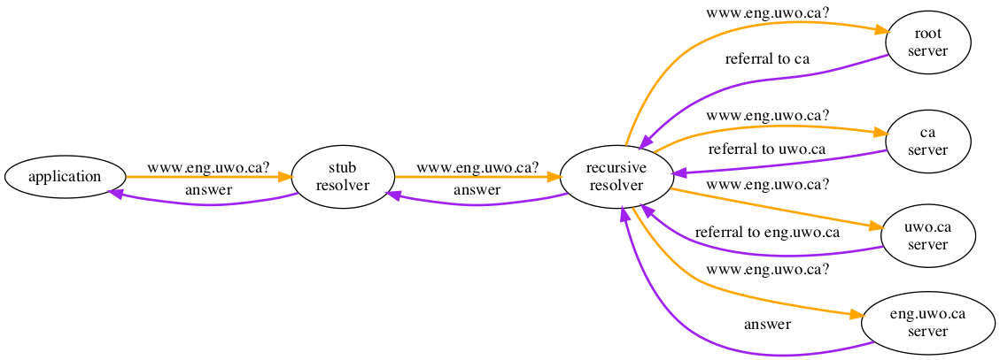

# CVE-2008-1447: The Kaminsky Attack

## Summary

[CVE-2008-1447](https://cve.mitre.org/cgi-bin/cvename.cgi?name=CVE-2008-1447)
describes a protocol-level vulnerability in the Domain Name System
(DNS) that was famously described by [Dan
Kaminsky](https://en.wikipedia.org/wiki/Dan_Kaminsky) in 2008 and
is colloquially known as the *Kamnisky Attack*.

The vulnerability exploits a weakness in the DNS protocol that is
exacerbated by particular implementation choices. The weakness had
been [observed](http://cr.yp.to/djbdns/forgery.html) by [Dr Daniel
J. Bernstein](http://cr.yp.to/djbdns/forgery.html) long before
Kaminsky [presented his
findings](https://www.blackhat.com/presentations/bh-dc-09/Kaminsky/BlackHat-DC-09-Kaminsky-DNS-Critical-Infrastructure.pdf)
at BlackHat but the potential impact of systematic abuse had not
really been recognised.  Bernstein had written his own DNS
implementation, djbdns, and had a history at the time of being
critical of the DNS protocol and of other DNS implementations (e.g.
see [Under the hood: DNS problems](http://cr.yp.to/djbdns.html)).
It seems possible that this particular observation was lost in the
rhetorical rainstorm. At the time of Kaminsky's work, Bernstein's
implementation was one of only a handful that were not trivial to
exploit.

## The DNS Protocol

Some appreciation for the technical details of the DNS protocol are
required in order to understand the mechanism and impact of the
Kaminsky attack. An attempt to describe the important components
of the protocol in words follows; [many other treatments are
available](https://google.com/?q=dns+tutorial). It is perhaps worth
noting that the DNS is awash with inconsistent terminology and
disressingly-inconsistent use of jargon, a problem that has only
recently [begun to be addressed](https://tools.ietf.org/rfc/rfc8499.txt)
in the [IETF](https://ietf.org).

Readers already familiar with the technical details of the DNS protocol
should [feel free to skip ahead](#the-kaminsky-attack).

### History

The DNS Protocol is old, the [original
specification](https://tools.ietf.org/rfc/rfc1034.txt) dating from
1987, an age when network abuse was rare and [the Internet was
small](https://www.computerhistory.org/internethistory/1980s/), far
from a necessity for people outside academia and a small number of
commercial companies. The design of the DNS has aged remarkably
well, considering that like many of its peer protocols it was
motivated more on functionality than robustness, privacy or
performance.

The original purpose of the DNS was to provide a scaleable way to
map names to addresses used on the Internet in a way that was
consistent with the distributed nature of the Internet as a network
of networks. The DNS as specified by [Dr Paul
Mockapetris](https://en.wikipedia.org/wiki/Paul_Mockapetris) was
the successful conclusion to this work, a collaboration between
many pioneers who communicated using the namedroppers mailing list,
mediated over a long period by [Dr Jon
Postel](https://en.wikipedia.org/wiki/Jon_Postel). The DNS protocol
introduced many novel concepts and accommodated the publication and
retrieval of many other data types beyond IP addresses.

The DNS is commonly described in terms of three separate concepts:
its namespace, the resource records that are attached to nodes in
that namespace and the infrastructure on which the whole system is
deployed.

### Namespace

The DNS uses a now-familiar, hierarchical namespace. Individual
names consist of an ordered series of labels. The conventional
notation is for those labels to be ordered, left to right, from
least-significant to most-significant and separated by dot characters
(ASCII 0x2E), significance relating to the hierarchy.

Most-significant labels (at the right) are colloquially known as
top-level domains (TLDs).

The maximum length of a label is 63 octets, and the maximum length
of a domain name is 255 octets.

Domain names may be presented with labels in scripts other than
US-ASCII.  In this case the representation of the label is known
as a U-Label; U-Labels are encoded into a US-ASCII form for
transmission between DNS clients and servers, known as A-Labels. The
whole business of dealing with Unicode in the DNS is [fraught with
complication](https://tools.ietf.org/rfc/rfc5890.txt); however, for
the purposes of this description the existence of U-Labels can be
safely ignored and A-Labels treated as any other US-ASCII DNS label.

Domain names are case-insensitive in US-ASCII (and complicated in
other scripts). Convenient examples of DNS names are `WHISPERLAB.ORG`
and `ENG.UWO.CA`.

### Resource Records

The DNS allows a variety of data structures to be published and
retrieved beyond the IP addresses that provided its original
motivation. Each resource record is represented on the wire with a
[unique code-point](https://www.iana.org/assignments/dns-parameters/dns-parameters.xhtml#dns-parameters-4), the RRTYPE and each is attached to a data
structure, the RDATA, that is (in general) RRTYPE-specific.

Some RRTYPEs require special handling by the DNS protocol, such as
NS which is used for zone cuts (delegations and referrals, the
mechanisms by which different administrative zones of the namespace
are connected) and CNAME, *canonical name*, which provides a
redirection function. The majority of assigned code-points are for
RRTYPEs that are handled consistently, however.

The DNS accommodates multiple classes, each of which can in principal
have a unique set of RRTYPEs available for use. In practice, only
one class is widely used, known as IN (for *internet*).

### Infrastructure

The infrastructure deployed to facilitate the publication and retrieval
of data in and from the DNS consists principally of authoritative
nameservers, recursive resolvers and stub resolvers. This is a
limited and incomplete taxonomy, but it is sufficient for this
discussion.

A stub resolver is generally implemented as a library in an operating
system (or in applications that have OS-scale aspirations, like
[some web browsers](https://www.google.com/chrome/). It provides
an API to dependent software that provides name resolution, and
achieves that resolution by sending queries towards recursive
resolvers. The choice of recursive resolver to which queries should
be sent is usually configurable, either manually by a user or
automatically using the provisioning capabilities of protocols such
as [PPP](https://tools.ietf.org/rfc/rfc1661.txt) and
[DHCP](https://tools.ietf.org/rfc/rfc2131.txt).

A so-called recursive resolver receives a query from a stub resolver
and attempts to gather all the information it needs in order to formulate
a response to return. Some information may be found in a local cache,
populated from the results of earlier searching. In the case of a cache
miss, the recursive resolver follows an iterative process of sending
queries with the same (QNAME, QCLASS, QTYPE) tuple as that received
to authoritative DNS servers. The choice of authoritative server is
generally that which is known to be responsible for the closest
enclosing domain name corresponding to the QNAME; that information is
obtained from the local cache. If no such information is locally available,
the query will be sent to one of thirteen so-called root servers.

Many, many authoritative servers are deployed on the Internet, each
responsible for a number of DNS zones. A DNS zone is an internally-
connected subset of the overall DNS namespace that is under uniform
administrative control. Zones are linked with delegations, which
are implemented with NS records.

Absent any configuration errors in any part of the system, an
authoritative DNS server will either respond with an authoritative
answer to the query received from a recursive resolver, if it is
authoritative for an enclosing zone, or will return a referral to
another authoritative server, in particular one authoritative for
a more closely-enclosing but superordinate zone to the QNAME.

For example, suppose a DNS resolver needs to resolve the query
(`WWW.ENG.UWO.CA`, `IN`, `A`) -- that is, obtain the A record and
corresponding RDATA corresponding to the domain name `WWW.ENG.UWO.CA`.
The A RRTYPE is used to encode IPv4 addresses.

A recursive resolver with an empty cache will first send a query
to a root server, which will result in a referral to a `CA` server.
A second query to a `CA` server will result in a referral to a `UWO.CA`
server, and a third query to a UWO.CA server will result in a query
to an `ENG.UWO.CA` server, which will provide an answer. The intermediate
records obtained during this process will all be cached for periods
determined by the respective zone administrators, and subsequent
queries, identical or similar, can take advantage of that locally-cached
information.

In the DNS protocol, a DNS query is characterised by a domain name 
(QNAME), a class (QCLASS) and an RRTYPE. At a high level, the DNS
can be considered a key-value store with a key represented as a 
(QNAME, QCLASS, QTYPE) tuple and the value returned (if available)
as RTYPE-specific RDATA.

Queries and responses are carried over a variety of transport protocols,
most commonly [UDP](https://tools.ietf.org/rfc/rfc768.txt). Queries
are addressed at the UDP layer to the well-known UDP port number
53, and incorporate a 16-bit QUERYID field in their headers to allow
matching responses to queries on multi-user (or, really, multi-tasking)
systems where multiple name resolution transactions may be in process
simultaneously.

The responses returned by the DNS protocol consist of four sections:

- A QUESTION section, containing the (QNAME, QCLASS, QTYPE) tuple copied from the query;
- An ANSWER section, containing authoritative information in response to the query;
- An AUTHORITY section, containing information about the servers that are authoritative for the DNS zone pertinent to the response; and
- An ADDITIONAL section that contains other information.

### Glue Records

The system of delegations and referrals between zones has an inherent
bootstrapping problem. Referrals from a parent zone to a child
include of a set of nameservers for the child zone, which are
specified not by address but rather as DNS names. Resolving those
nameserver names in order to send a wire-format query itself requires
DNS resolution, which in many cases is not possible without other
information. Consider for example the CLOUDFLARE.COM domain whose
nameservers, NS1.CLOUDFLARE.COM through NS4.CLOUDFLARE.COM, resolution
of which, in turn, requires their own addresses to be obtained.

In practice this problem is avoided by the inclusion of non-authoritative
DNS data in the parent zone. Such data is included in the referral
response from the parent nameservers, and is carried in the ADDITIONAL
section.

Records in the ADDITIONAL section of a response are not authoritative,
which is why they don't appear in the ANSWER section. However, practical
operation of the protocol requires them to be cached under certain
circumstances, and many implementations are more liberal than that in
retaining such data.

## The Kaminsky Attack

The Kaminsky attack is a way for a remote attacker to insert
incorrect, potentially-malicious data into a DNS resolver's cache
using mainly weaknesses in the protocol rather than defects in
particular implementations. Since [almost all other protocols depend
upon the DNS](#impact-and-exploitation) and since the potential to
be coerced into connecting to a rogue system across a network is
more or less the definition of a network service vulnerability,
this represents a broad base of risk for most services delivered
over the Internet.

### Key Insights

The Kaminsky attack depends upon a few key insights.

1. The QUERYID field in the DNS header, used by DNS resolvers to match DNS responses to queries, is a 16-bit field. Collisions are consequently relatively easy to achieve with the network connectivity available in 2008. This problem was anticipated by Bernstein in 1999.
2. You don't need to attack just a target name; you can introduce data in a response using many, similar names in the same zone, since each one of them can be linked to the target name with RRTYPEs like NS and CNAME. This dispenses with a common reaction to Bernstein's original observation, that the attack window was limited by the period in which accurate data would persist in a cache, masking opportunities to continue the attack.
3. There are an enormous number of ways of triggering a legitimate client of a DNS resolver to ask a particular question, more in 2008 than 1999 due to the increase in number and sophistication of services and applications commonly used by end users.
4. Many resolver systems (in 2008) exhibited very predictable source-port selection for outbound DNS queries, making it simple to synthesise attack responses that would be accepted at the UDP layer.

### Mechanism

There are many nuances to the mechanisms proposed by Kaminsky and his various
collaborators, but the principal mechanism is as follows:

1. Trigger an end-system to look up a non-existent name in a target DNS zone using a target resolver. For open resolvers this can be done directly; for resolvers with access restrictions, end-systems can be triggered into doing DNS lookups by feeding them embedded objects in e-mail messages and web pages, or in a variety of other mechanisms. For a particular DNS name to be a viable target it has to be used; triggering that use amongst a large community of end-users is a relatively simple problem.
2. Craft a DNS response to the query that includes by reference the target DNS domain name, e.g. by returning the target name and associated poisoned RDATA as a CNAME or NS target to queried name.
3. Flood the resolver with DNS responses using a variety of QUERYIDs and source ports, guided by observed behaviour at real authoritative servers under the control of the attacker.

With the the low entropy available with predictable source port selection
on queries and the narrow QUERYID field, Kaminsky was able to demonstrate
insertion of arbitrary data into DNS caches in around ten seconds, using
commodity hardware and network infrastructure.

In the example above, an application is triggered into looking up
the name `RANDOM123.WHISPERLAB.ORG`. An attacker bombards the target
resolver with responses, exhausting the QUERYID space, perhaps
guided by observed predictable source ports in the queries made by
the resolver. The attacker's responses are crafted to match the
triggered query from the application, but also include extra
(cacheable) data for another name, `WWW.WHISPERLAB.ORG`. If the
attack succeeds, the resolver's cache now contains the attacker's
desired data for `WWW.WHISPERLAB.ORG` and subsequent queries from
other applications for that name are answered from the cache with
the attacker's response.

In the event that the attack using `RANDOM123.WHISPERLAB.ORG` is not
successful, the attacker continues with other random labels until she
succeeds. These attacks can take place in parallel to the extent that
network bandwidth exists to carry the responses.

Using this technique, reliable pollution of caches (even without
especially predictable source port selection) has been shown to be
possible with modest hardware in low tens of seconds.

### Impact and Exploitation

The ability to subvert the DNS at will affords many opportunities
to exploit systems that otherwise would be protected by higher-layer
protocols or security perimeters. For example, the authenticity
protection of [TLS](https://tools.ietf.org/rfc/rfc8446.txt) relies
upon a matching DNS name, not an address; signed certificates which
will be treated as legitimate by all mainstream browsers are trivial
to obtain from commercial certificate authorities (or using automated
protocols like [ACME](https://tools.ietf.org/rfc/rfc8555.txt), as
implemented by [Let's Encrypt](https://letsencrypt.org).  Anything
that relies upon TLS for protection is vulnerable to man-in-the-middle
attacks if the DNS and server certificates can no longer be trusted.

Kaminsky reported in his [presentation at BlackHat
2008](https://www.blackhat.com/presentations/bh-dc-09/Kaminsky/BlackHat-DC-09-Kaminsky-DNS-Critical-Infrastructure.pdf)
that there had been significant exploitation of this vulnerability
observed in the real world. Dagon *et al* reported that they had
detected a poisoning event in 1 to 3% of the unpatched servers they
monitored, and that phishing attacks incorporating this mechanism
had also been observed.

However, the response by the DNS vendor and operator community was
swift and effective. Kaminsky reported a 66% patch rate (measured
by server) within a month of disclosure, a rate that would be have
been significantly higher if measured by end-user, since resolvers
with significant end-user populations were subject to considerably
higher attention than those that handled less traffic.

### Mitigation

Many mitigation techniques were proposed, some of which focused on
tightening the algorithms for processing CNAME and NS targets and
the processing of ADDITIONAL section glue by a resolver. However,
the two principal avenues for mitigation were (a) increasing the
available entropy in outbound queries, making it harder to spoof
responses and (b) the deployment of DNSSEC as a cache-protection
mechanism.

#### Query Entropy

The importance of source-port randomisation in outbound queries had
already been established at the time the vulnerability was disclosed,
but many implementations did not randomise source ports effectively
by default since doing so had a negative impact on query performance.
Several widespread implementations subsequently changed their
defaults, and various tools were promoted to allow end-users to
check the observed source port randomisation of the resolvers they
happened to be using, such as [this one from
DNS-OARC](https://www.dns-oarc.net/oarc/services/dnsentropy).

An [interesting
proposal](https://tools.ietf.org/html/draft-vixie-dnsext-dns0x20-00) was
made by [Paul Vixie](https://en.wikipedia.org/wiki/Paul_Vixie) which
added entropy to a query by modulating the alphabetic case of the
QNAME in a random pattern and requiring responses to match, taking
advantage of the specification that DNS A-Labels are case-insensitive.
However, some authoritative server implementations were found not
to preserve the case of queries on legitimate replies, such behaviour
not being required by the specification; the mechanism did not see
widespread adoption.

#### DNSSEC Deployment

[DNSSEC](https://www.ietf.org/rfc/rfc4033.txt) is a set of extensions
to the DNS which allow zone publishers to include cryptographic
signatures alongside the existing RRSets in DNS zones, with a chain
of trust provided by signatures over new "delegation signer" records
by parent zone keys that act as secure introductions to the
corresponding keys in child zones.

Only a small handful of top-level domains had been signed in 2008,
and in particular the lack of a single trust anchor to allow DNSSEC
validation across the whole DNS namespace was not possible without
a signed root zone. The root zone was managed by a partnership
between three separate organisations at the time, all of whom
generally took a conservative approach to change, and especially
with reference to a system as critical as the global DNS.

The global response to the Kaminsky disclosure in the technical
community provided the political impetus required for the deployment
of DNSSEC in the root zone, a project that ultimately concluded in
2010 as a partnership between [ICANN](https://icann.org),
[VeriSign](https://verisign.com) and the [US Department of Commerce
National Telecommunications and Information Administration
(NTIA)](https://ntia.doc.gov). The first root zone key ceremony,
at which the first DNSSEC key pair and signatures were generated
for use in the root zone, Dan Kaminsky was enrolled as an inaugural
Trusted Community Representative, retaining a key-share of the
System Master Key used to encrypt a backup of the Root Zone Key
Signing Key to be kept in secure storage for disaster recovery.

At the time of writing most TLDs
have been signed and a [significant proportion of DNS queries are
subject to
validation](https://stats.labs.apnic.net/dnssec/XA?c=XA&x=1&g=1&r=1&w=7&g=0).
The final, hurried touches to this presentation are actually being
made from the offices of [NiRA](https://nira.org.ng) in Lagos,
Nigeria, following [a
workshop](https://nsrc.org/workshops/2019/nira-nsrc-icann-dnssec/)
intended to support the deployment of DNSSEC in the NG (Nigerian)
top-level domain.

